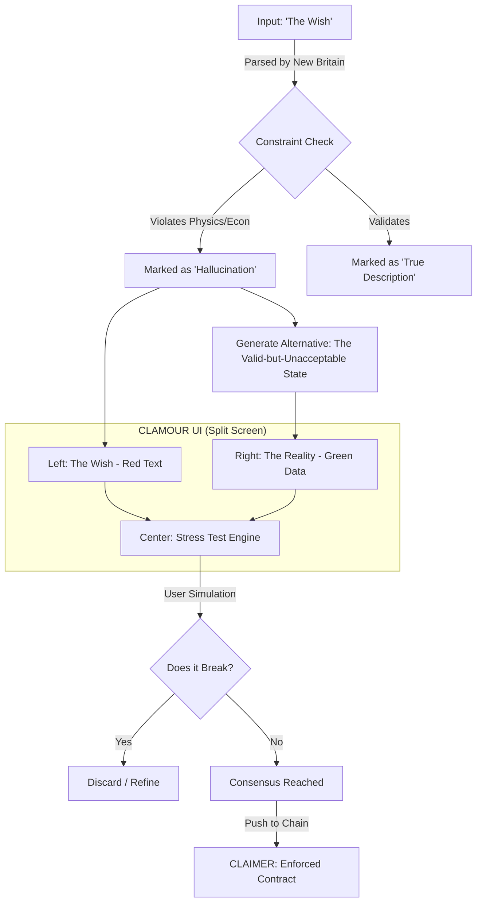

# CLAMOUR: The Policy Wind Tunnel

**Friction is a feature.**

---

## What It Is

Clamour is a deliberation interface that visualizes the gap between political rhetoric and simulated reality. It borrows the visual language of software development (diffs, pull requests) rather than social media (feeds, likes).

You aren't "posting." You are submitting a **Pull Request to the British State**.

---

## The Core Mechanic

The screen is divided vertically into three zones:

| LEFT PANE | CENTER | RIGHT PANE |
|-----------|--------|------------|
| **The Wish** | **The Friction** | **The Reality** |
| Source: Manifesto / Tweet | Stress Test Engine | Source: The Library (Navigation) |
| Political rhetoric | User interaction | Simulated outcome |

### Example

| The Wish | | The Reality |
|----------|---|-------------|
| "We will cap rents to lower costs." | ⟷ | **Supply Constraint Model v4.2** |
| *Sentiment: High desirability, low specificity* | | Outcome: Supply drops 14% in 24mo |
| | | Trade-off: Waiting lists +3 years |
| | **[ STRESS TEST ]** | Cost: £4.2bn lost tax revenue |
| Reality Gap: 🔴 CRITICAL | | |

---

## The Workflow

### Step 1: Ingestion (Left Pane)

The user (or system) inputs a standard political promise:

> "Build 1.5m homes without changing the Green Belt"

The system highlights text in **red** where it conflicts with known constraints (physics, economics, land use).

**Hover state:** `Error: Spatial constraint violation. Not enough non-protected land exists for this density.`

### Step 2: Retrieval (Right Pane)

The navigation engine automatically retrieves a **True Description** that matches the intent but fixes the mechanism.

It displays a "Valid but Unacceptable" solution:

> "Build 2m homes by reclassifying 'Grey Belt' scrubland and mandating 6-story density near stations"

Trade-offs highlighted in **green**:
- Cost: Local visual change
- Benefit: GDP +1.2%

### Step 3: Interaction (Center Gutter)

The center button isn't "Like" or "Reply." It is **STRESS TEST**.

Users throw variables at the Right Pane to try and break it:
- "What if interest rates hit 7%?"
- "What if cement prices double?"
- "What if construction labour drops 20%?"

If the Right Pane survives the stress test, the Reality Gap closes. The solution is marked as **COMPILED**.

---

## The Logic Flow



---

## Why This Changes the Game

### It kills the strawman
You cannot simply criticize the "Valid" solution. You have to submit a parameter (interest rates, costs, labour supply) that breaks it. **If you can't break the math, your opinion doesn't matter.**

### It visualizes the "Unacceptable"
By showing the cost of the Status Quo (Left Pane) next to the benefit of the Radical Solution (Right Pane), the "Unacceptable" solution starts to look rational.

### It creates accountability
When a solution survives stress testing and reaches COMPILED status, it becomes a candidate for enforcement via Claimer. Politicians who promised something different have to explain why they're not implementing the version that actually works.

---

## The Flywheel Connection

```
New Britain (ideation) → Clamour (stress testing) → Claimer (enforcement)
         ↑                                                    |
         └────────────────────────────────────────────────────┘
                        Feedback loop
```

- **New Britain** surfaces what's actually possible
- **Clamour** lets the public break or validate it
- **Claimer** holds power to what survived

---

## Technical Requirements

### Navigation Engine
- Constraint database (physics, economics, law, land use)
- Model library (housing, transport, energy, health)
- Retrieval system that matches intent to valid mechanisms

### Simulation Layer
- Parameter injection for stress testing
- Monte Carlo runs for uncertainty
- Clear pass/fail thresholds

### Interface
- Split-screen diff view
- Real-time constraint highlighting
- Stress test input with instant feedback

---

## What We're Looking For

Builders who understand:
- That friction is a feature, not a bug
- That political debate should look like code review, not Twitter
- That the gap between what's promised and what's possible is the problem

If that's you, get in touch.

---

*Part of [The World Transformed](../README.md)*
